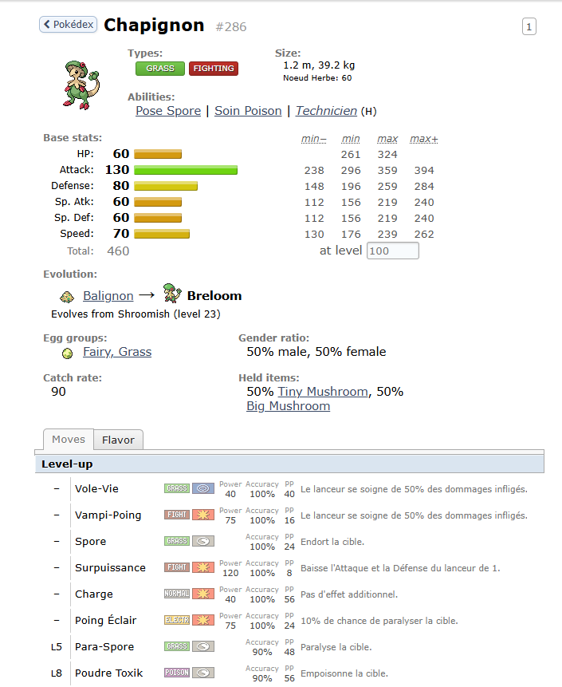

# Dex et Calc Run and Bun FR

Add-on Chrome minimaliste de traduction du [Dex de Run and Bun](https://dex.runandbun.com/) et du [Calc de Run and Bun](https://calc.runandbun.com/) en Français.



## Installation

1. Télécharger ce Repo (```git clone``` ou "Code" -> "Download ZIP") et extraire l'archive.

2. Sur Chrome :
- Extensions
- Gérer les Extensions
- Activer Mode Développeur (haut à droite)
- Charger l'Extension non empaquetée (haut à gauche)
- Sélectionner le dossier dans lequel se trouve l'archive dézipée

3. Aller sur le [Dex de Run and Bun](https://dex.runandbun.com/) ou sur le [Calc de Run and Bun](https://calc.runandbun.com/)

## Utilisation

Chaque page est traduite automatiquement, les mots écrits dans les différentes barres de recherches sont traduits également (Ecrire "Chapignon" remplacera automatiquement votre texte par "Breloom" (son nom Anglais)).

## Bugs/Mises à jour

Si un bug ou problème est rencontré, n'hésitez pas à le reporter.

__Note__ : Seuls les textes "majeurs" (Pokémon, Attaques, Talents, Objets) sont traduits pour l'instant.

Si vous souhaitez continuer le développement de l'Add-On, libre à vous de faire des Forks et d'ouvrir des Pull Requests.

## Crédits

- Concept : [Magnatix](https://x.com/Magnat_Hique)
- Ressources de Traduction Showdown FR + Explications Perso : [Sykless](https://github.com/Sykless)